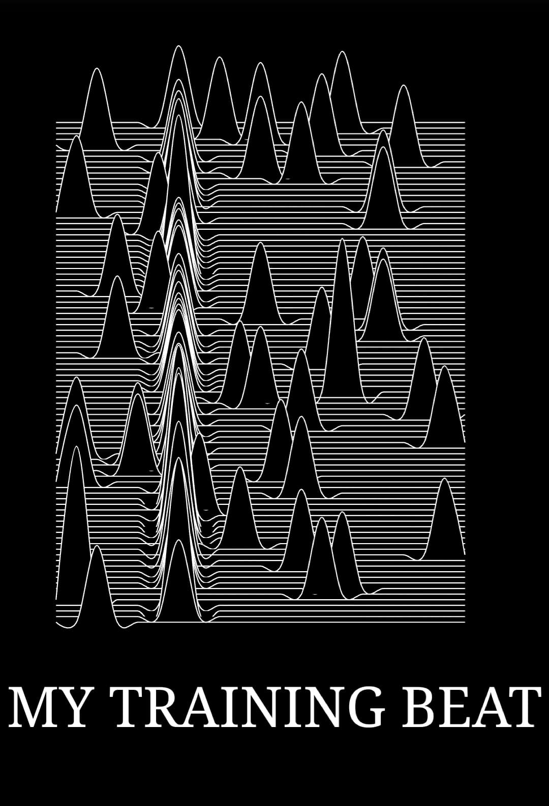

# Visualization of my training

This is a simple visualization inspired by the Pulsar plot of the album cover of <a href="https://en.wikipedia.org/wiki/Unknown_Pleasures">Unknown Pleasures</a> by <i>Joy Division</i>. Based on a simple ridgeline plot from d3.js. The result can be seen at <a href="https://jklintan.github.io/visualize-your-training/">https://jklintan.github.io/visualize-your-training/</a>.

The data used is a csv-file containing training data that can be downloaded from <a href="https://connect.garmin.com/">Garmin Connect</a>. The height corresponds to the maximum elevation of the training, the position of the x-axis is based on the start time of the training and the width is based on the duration of the training. I'm currently working on expanding the visualization with some user-input to allow to create a visual compelling result of the trainings done during the past year. 

## Example

